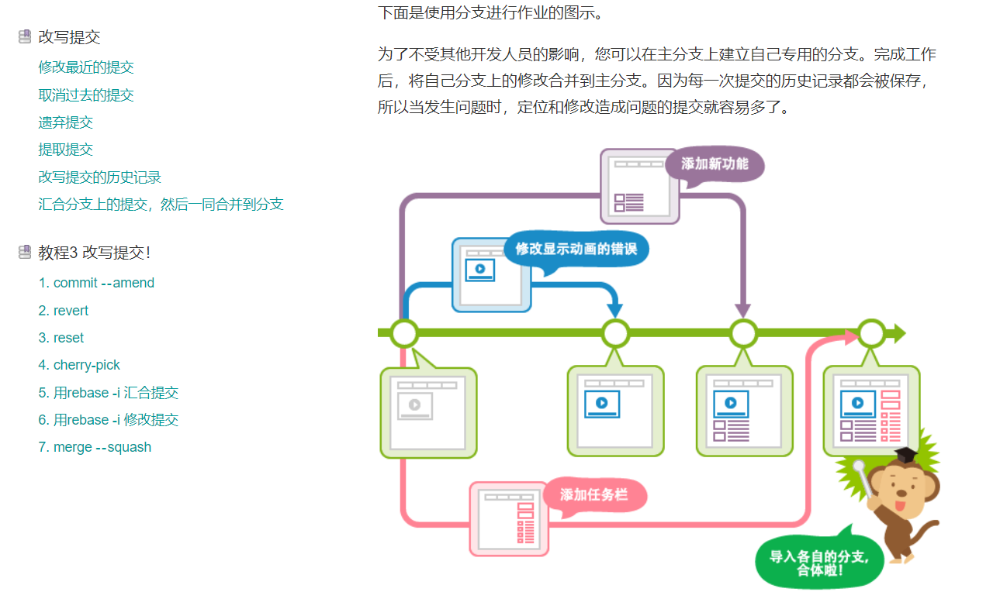

> 此篇章收录与 "Java硬核学习指南 |  Java2Top"（持续更新完善中，欢迎 start....）

在网上看到不少博主都在分享各种书籍，整理了很全面的 PDF，可以说是非常用心，包含的也非常丰富。但是，如果我是一名初学者，看到那么多书籍，无疑就是 ”收藏夹吃灰“ 哈哈~。

因为，书籍太多，没有条理，没有形成序列，而且各种质量的都杂烩在一起啦，让人第一眼看斗志昂扬，第二眼看只想收藏。

不知道什么阶段看什么书，不知道带着什么目的去看，**初期着重学什么？后期着重学什么？如何快速应对面试？**`怎样快速建立完备知识体系？`

市面上关于编程学习的书籍非常多，但并不是每一本都值得去学习，所以挑选书籍也是一种能力。有一些书籍虽好，但不一定适合你（枯燥、难懂），而且各种PDF，不如在线电子书来的方便。

**本站会根据当下面试热点，技术潮流持续收集适合用于《校招面试求职》的精品书籍，带你 畅游计算机~**

## 一、数据库

### MySQL

`学习目标`

**前期**
掌握基本语法，形成大体映像，切记把 SQL 练熟，各种连接查询。

- **[《MySQL 必知必会会》](https://book.douban.com/subject/3354490/)** ：非常薄，如同全景地图让新手能俯瞰全局，快速建立基础知识体系，入门；也可以用作快速回顾基础。
- [《数据库系统概念》](https://book.douban.com/subject/10548379/)：这本书是一本非常经典的书籍，涵盖的知识比较多，也是建立知识体系。但是我觉得太枯燥，看不进去。

**后期**
看书、看专栏，深入了解底层原理，如锁、索引、事务实现原理、引擎、架构、主从等。

- **[《高性能 MySQL》](https://book.douban.com/subject/23008813/)** ： 同样是 MySQL 领域的经典之作！属于进阶加餐必备。尤其是 第 5 章（创建高性能的索引） 、第 6 章（查询性能优化）仔细研读，这个在使用和面试中属于重点难点。
- **[《MySQL 技术内幕》](https://book.douban.com/subject/24708143/)** ：你想深入了解 MySQL 存储引擎的话，看这本书准没错！

**实战模拟**

[《如何开发一个简单的数据库》](https://cstack.github.io/db_tutorial/)：如果你觉得自己逼格已经拉满啦，tm 深知想自己独创一门 ”功法“ ,OK，你可以参考这个教程，带你 自己动手开发一个数据库

**面试补充**

OK，走到这，你已经有了对 MYSQL 有了清晰的认识，但是可能还存在某些疑问，如何去应对面试可能还是有些力不从心，推荐这两个专栏，基本涵盖了 大厂面试 可能问到的所有关于MySQL的面试问题。

- [《MYSQL实战45讲》](https://)：极客时间《MYSQL实战45讲》（专栏），对 MySQL 的难点、重点、面试点、底层各原理进行了讲解，适合面试加餐。
- [《MySQL 是怎样运行的》](https://book.douban.com/subject/35231266/)：这本书善用各种通俗易懂的图结合讲解，语言诙谐幽默，而且特细节易懂，深入到源码，不像国内大多数教程，又臭又长，一个概念绕半天；同时，这本书的内容也适合用于面试。

### Redis

`学习目标`

**前期**

只要学会基本使用，跟着视频学着搭搭集群、哨兵之类的，熟悉常用的基本命令、场景。能在项目简单使用。

- Redis 数据类型简介。https://redis.io/topics/data-types-intro
- 直接在浏览器中试用 Redis。[https://try.redis.io](https://try.redis.io/)
- Redis 命令的完整列表。https://redis.io/commands
- Redis 官方文档中还有更多内容。https://redis.io/documentation

**后期**

主要针对面试，网上的视频千千万万，不过都讲的很基础，只能作入门视频，想要深入理解与学习，还得看书与一些好的专栏论坛等。需要掌握各种`数据结构底层`实现，`持久化`、`缓存淘汰策略`、基本实现原理、`各种使用场景`、`缓存雪崩/击穿/穿透`，`集群`等等。

- 推荐 [《Redis 设计与实现》](https://book.douban.com/subject/25900156/)：基础、相关原理以及各种数据结构底层介绍，业界公认的经典书籍
- [《Redis 实战》](https://book.douban.com/subject/26612779/)：基础、实战两手抓。
- [《Redis 开发与运维》](https://book.douban.com/subject/26971561/)：这本书开发同学可以用作工具书籍，用来查阅参考；运维同学建立好好看看，写得很不错。

**自己研读源码**

若自己想研读源码，推荐开源项目《Redis 3.0 源码注释》

- [ 带有详细注释的 Redis 3.0 代码](https://github.com/huangz1990/redis-3.0-annotated)
- https://github.com/antirez/redis 

本文涉及的视频与书籍大部分的 在线阅读链接或者下载链接已经整理好了，需要的直接在微信搜索公众号【**小龙coding**】回复【**书单**】即可下载

也可以截图后，微信扫码关注回复【**书单**】

## 二、计算机基础

首先给大家明确，这部分很重要、很重要、很重要，简单说，大厂面试需要，对建立完整知识体系有极大帮助；

**推荐视频课程+书籍结合的方式，千万不要抱着大块头的书从头啃到尾。**

同时，我会结合 国内外的经典课程和学习资料为大家梳理，如果有可能，希望多动手实践。

### 计算机网络

学习计算机网络我给大家分享一个方法，按照「`总—分—总`」的思路来学习。（此总分总是我胡乱用词，相信大家可以贴切理解）

**`什么意思？`**

#### 体系流程—总

首先，不要着急去学某个单独的章节，或者一来就从头到尾挨着去学。这样效率和收获会极低。

我们应该首先了解计算机网络整个脉络，「`数据是怎样在网络中传送`」的，也没有叫你每个细节都要搞清，浅尝即止。不过我们需要在脑海形成一个整体流转过程

> 推荐【网络】半小时看懂<计算机网络>
>
> https://www.bilibili.com/video/BV124411k7uV

- 《**网络是怎样连接的**》：可以视频配合书籍了解

#### 知识详解—分

然后，我们再根据脑海的大体映像，带着可能存在的某些细节问题再逐步去学习，剖析细节，全面学习。

> 推荐-中科大-计算机网络
>
> https://www.bilibili.com/video/BV1JV411t7ow

其中对于HTTP、TCP、IP 等协议是特别重要的，此处为大家推荐几本优质书籍。

**《图解HTTP》**、**《图解TCP/IP》**,这两本书都以图文形式很好的去讲解知识，有趣易懂。

#### 实战抓包—总

除了理论知识之外，学习计算机网络非常重要的一点就是：“**动手实践**”。这点和我们编程差不多

最后以抓包实战总结收尾，推荐学习《**Wireshark 网络分析的艺术**》，学习使用 `Wireshark `工具，进行抓包实战，亲自体会各个层，各个协议。

> 推荐书籍：《Wireshark 网络分析的艺术》、《Wireshark 网络分析就是这么简单》

另外，想要功力更上一层楼，给大家推荐基本经典书籍：

- **《计算机网络 - 自顶向下方法》**

对于 TCP/IP 网络模型深入学习的话，推荐《计算机网络 - 自顶向下方法》，这本书从 HTTP 开始，逐层剖析，详解，对建立完整且有深度的知识体系很有帮助。

- **《TCP/IP 详解 卷一：协议》**

其次，如果想要深入学习 TCP，推荐大家赋有计算机网络圣经之说的《TCP/IP 详解 卷一：协议》，此书虽然枯燥，但是真的讲得很细，很好。

#### 加餐

- 推荐 standford 课程 CS144，国外大佬经典课，每个部分都会带你用代码实现，并且配有详细的作业，讲义和教程，源代码。

[CS 144： 计算机网络导论](https://cs144.github.io/)

[CS144: Introduction to Computer Networking (stanford.edu)](https://www.scs.stanford.edu/10au-cs144/)

此外，还有Github 上就有一些名校的计算机网络试验/Project：

- [哈工大计算机网络实验](https://github.com/rccoder/HIT-Computer-Network)
- [《计算机网络－自顶向下方法(原书第 6 版)》编程作业，Wireshark 实验文档的翻译和解答。](https://github.com/moranzcw/Computer-Networking-A-Top-Down-Approach-NOTES)
- [计算机网络的期末 Project，用 Python 编写的聊天室](https://github.com/KevinWang15/network-pj-chatroom)
- [CMU 的计算机网络课程](https://computer-networks.github.io/sp19/lectures.html)

本文涉及的视频与书籍大部分的 在线阅读链接或者下载链接已经整理好了，需要的直接在微信搜索公众号【**小龙coding**】回复【**书单**】即可下载

也可以截图后，微信扫码关注回复【**书单**】

### **操作系统**

`Operating System:`

**1、操作系统（哈工大李治军老师）32讲（全）超清**

> MOOC：https://www.icourse163.org/course/HIT-1002531008
>
> 配套实验课：https://www.shiyanlou.com/courses/115

我愿称之为一绝，李老师的这门课。绝对牛逼绝对硬核，这门课建议先去学习汇编课程基础，再来看会有更深刻的收获；不然看到中间会很晕。

**2、 2020 南京大学 “操作系统：设计与实现” (蒋炎岩)**

> B站：https://www.bilibili.com/video/BV1N741177F5
>
> 南大操作系统，yyds，不多这个人感觉更适合加餐和加深理解

如果是为了考研，建议看传统的操作系统课程，北大的课程理论讲解比较细致，清华的课程更深入难度更大。
如果是想真正的提升实战能力，强烈推荐蒋岩炎老师的相关视频，MIT也很好，不过英语能力有较高的要求。

**3、清华出版**

> 清华出版的操作系统课程，配套实验是 UCore：
>
> https://www.xuetangx.com/course/THU08091000267/5883104

**4、【麻省理工学院】MIT 6.S081 操作系统工程 operating system engineering**

> 官网（英文）：https://pdos.csail.mit.edu/6.828/2020/schedule.html
>
> 中文字幕：https://www.bilibili.com/video/BV1Dy4y1m7ZE/

这门课，我个人觉得直接封神。虽然它小但是却很完整，重现了经典的 **UNI XV6**，可以学习到设计思维，循序渐进，一步一步在你的脑海里建立起 OS 的大厦框架。相信程序员大部分都知道这门课，国外的课就是牛逼~

**5、其他**

个人感觉，上述的相关课程对建立完整知识体系和加餐补给都很够了，十分不错。但是可能对新人有些难度，大家也去网上找一些基础视频先大概看看，对于上面可能更好理解。

**我该学到什么程度？**

对于大部分同学，其实大概梳理一下整个操作系统的知识体系即可，对于你构建你的完整知识体系和找工作已经足够。不过如果你想往研究方向或者就个人兴趣爱好而言，可能需要再深度研究。

在看视频学习同时可以结合一些经典书籍学习，比如

- [《操作系统设计与实现》](https://book.douban.com/subject/2044818/)：操作系统的权威教学教材。
- [《Orange'S:一个操作系统的实现》](https://book.douban.com/subject/3735649/) ： 从只有二十行的引导扇区代码出发，一步一步地向读者呈现一个操作系统框架的完成过程。这是一个我看的少数能把计算机的书写得很过瘾的作者

### Linux

《**鸟哥的Linux私房菜**》

网站内容主要分为几个部份：

- **基础学习篇**：学习掌握、管理一部 Linux 系统为主的技巧;
- **基础训练教材**：以教学为主，提供教师与学生一套基于虚拟化环境的 Linux 教学设计
- **服务器篇**：2022 年以后，预计以虚拟化 KVM 为基础，设计一个小机房的网络训练为主。
- **环工空品模式篇**：预计介绍三个模式： AERMOD， HYSPLIT， CMAQ 等，不过真的要有时间...
- **特殊事件处理**：工作、教学遇到的一些窘境所找到的问题处理模式，比较像 Q&A 的形式

试验与教学结合，可以说是 `Linux` 界的经典之经典。

此外，也可参考学习，Linux工具快速教程 — Linux Tools Quick Tutorial (**linuxtools-rst.readthedocs.io**)

## 三、Java系列

`学习目标`

**前期**
1、对Java语言形成一个大概理解与认识。
2、熟悉基本语法的使用，如果你有 C 与 C++ 的基础，上手也会更快。
3、最后能独立的做一个简单的系统。

### Java基础

**[《Java 核心技术卷 1+卷 2》](https://book.douban.com/subject/34898994/)**

本书由拥有20多年教学与研究经验的资深Java技术专家撰写（获Jolt大奖），是程序员的优选Java指南。基本是必读书籍

《Thinking in Java》和《Core Java》配合起来学习，前者内容丰富，在讲述Java语言的同时把Java编程思想也娓娓道来，让人如沐春风；

后者偏重于讲解Java技术，举例说明了大量 API 的使用。这两部书在讲解 Java 上殊途同归，都值得放在书桌上时常翻阅。

**[《Java 8实战》](https://book.douban.com/subject/26772632/)**

全书分四个部分：基础知识、函数式数据处理、高效 Java 8 编程和超越 Java 8，本书全面介绍了 Java 8  这个里程碑版本的新特性，包括Lambdas、流和函数式编程。

**后期**
1、深入剖析源码，比如` HashMap`、`ArrayList` 等集合，并发包 `JUC` 下的相关类等。
2、深入理解 `JVM`
3、理解反射机制等

本文涉及的视频与书籍大部分的 在线阅读链接或者下载链接已经整理好了，需要的直接在微信搜索公众号【**小龙coding**】回复【**书单**】即可下载

也可以截图后，微信扫码关注回复【**书单**】

### Java并发

**[《Java 并发编程之美》](https://book.douban.com/subject/30351286/)**

《Java并发编程之美》通过图文结合、通俗易懂的讲解方式帮助大家完成多线程并发编程从入门到实践的飞跃！

[**《Java并发编程的艺术 》**](https://book.douban.com/subject/26591326/)

《Java并发编程的艺术》内容涵盖Java并发编程机制的底层实现原理、Java内存模型、Java并发编程基础、Java中的锁、并发容器和框架、原子类、并发工具类、线程池、Executor 框架等主题，每个主题都做了深入的讲解，同时通过实例介绍了如何应用这些技术

这两本书都很好，但是当时学习时我更喜欢看《**Java并发编程的艺术**》，觉得讲的知识和讲解方法深度更适合我

**《深入浅出Java多线程》**

这是几个大佬在读完市面上关于 Java 并发编程的资料后，感觉有些知识点不是很清晰，于是，研读整合了相关博客、书籍、论文结合加以画图或者编写 Demo 进行加工著作而成。

###  JVM

**[《深入理解 Java 虚拟机》](https://book.douban.com/subject/34907497/)**

废话不多说，这本是业界公认写得非常好的经典书籍，很多网上的视频课都是参照这本书然后讲解的。**国产崛起**

当然，都说是高级部分啦，初学你只看书肯定不太懂得，强烈推荐配合 《**尚硅谷宋红康JVM**》这套视频跟着学

**课程的内容分为 3 部分：**

1. 《内存与垃圾回收篇》
2. 《字节码与类的加载篇》
3. 《性能监控与调优篇》

至此，Java基础 到 高阶你基本掌握啦。

> 说明：框架之类的只是开发工具，若是大厂，基本用的都是自己封装的框架，因此掌握基本原理和基本使用即可，理解思想。

### 设计模式

**《图解设计模式》**

该 电子书 使用图形和代码结合的方式来解析设计模式；

每个模式都有相应的对象结构图，同时为了展示对象间的交互细节， 我会用到时序图来介绍其如何运行；（在状态模式中， 还会用到状态图，这种图的使用对于理解状态的转换非常直观）

此外，还会给你结合具体应用的实例讲解，并且每个设计模式都会做最终总结

## 四、其他工具

### GIT

**《猴子都能懂的GIT入门》**

猴子都能懂的 GIT 入门教程是怎样的？这是一份适合不同基础同学的图文GIT教程，根据基础不同分为入门、高级，文简意骇，图文并茂，基本工作开发中常用的操作都有涉及。同时也可以使用 GIT 索引作为学习工作的命令查询工具，哪里不会点哪里，快收藏学习吧~

**《GitHub秘籍》**

如果你还想学一些关于 Git 的骚操作，我强烈建议可以学习这本 Git 界的九阴真经 "GitHub秘籍"。该 ”秘籍“ 收录了一些 Git 和 Github 非常酷同时又少有人知的功能。

这是他的部分目录截图：

### Nginx

《**Nginx开发从入门到精通（淘宝团队）**》

该书的作者为淘宝核心系统服务器平台组的成员，以从模块开发逐渐过渡到 `Nginx` 原理剖析的思路进行编写的。以便众多的开发以及运维同学都可以更好了解 Nginx 模块的开发以及它的内部原理。

## 五、面试突击

这是作者靠实习和秋招提前批`不断面试总结`、看书、研究面经、`和面试官请教`、查资料查漏补缺，不断熟悉面试的`基本套路`和`问题模式`把每次的点点滴滴都总结记载了下来，每次面前`复习预热`。

[《**BAT面试笔记**》（点击）](https://mp.weixin.qq.com/s/SQH78Ik72jEQRKIdJ9cPTg)

包含 Java基础、并发编程、JVM、MYSQL、Redis、设计模式、数据结构、计算机网络、操作系统、SSM、SpringBoot、分布式基础、Linux、**项目分析、场景模拟、自我介绍**等。

内容说多不多，说少不少，基本涵盖了BAT和其他中大厂面试各方面爱问常问的问题，**回答也都是用人能明白的话**（讨厌官方懂不起记不到）总结提炼易记的形式呈现。

本文涉及的视频与书籍大部分的 在线阅读链接或者下载链接已经整理好了，需要的直接在微信搜索公众号【**小龙coding**】回复【**书单**】即可下载

也可以截图后，微信扫码关注回复【**书单**】

## 六、免责声明

书籍全部来源于网络其他人的整理，此处仅做网上书籍的在线电子书或者下载链接的收集整理，如有侵权，非常非常抱歉，请马上联系我，我立刻删除对应链接。我的邮箱：xlcoding@163.com

